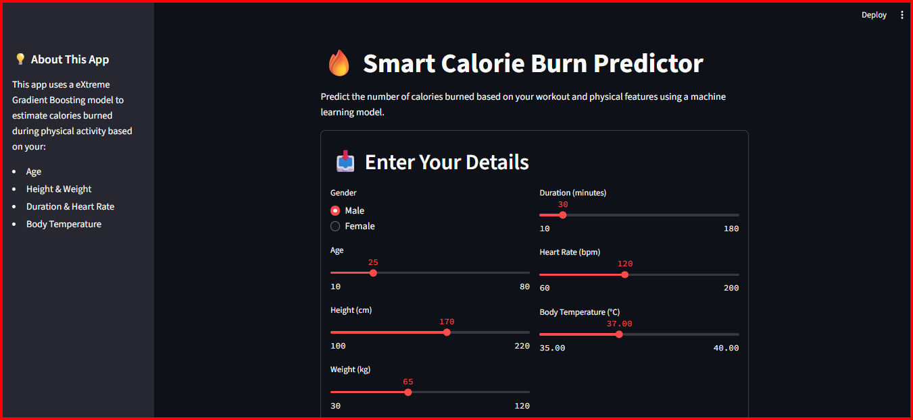
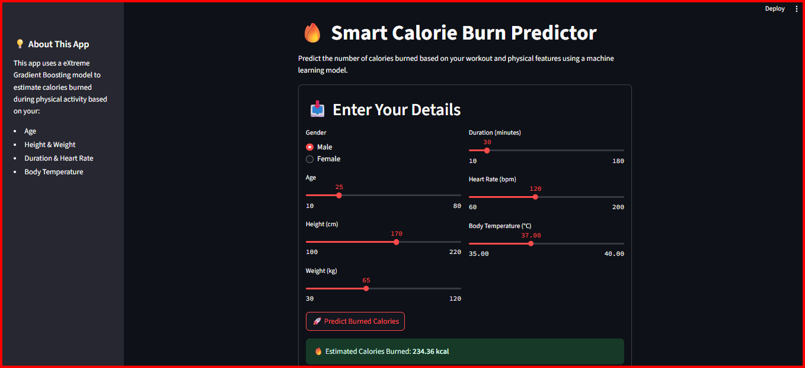

# 🔥 Smart Calorie Burn Predictor

This project is a **machine learning-powered web app** that predicts the number of calories burned during physical activity based on user details such as **age, gender, height, weight, duration, heart rate, and body temperature**.

The app is built using **Streamlit** for an interactive UI and **XGBoost (Extreme Gradient Boosting)** for the predictive model.

---

## 📌 Features

- Predict calories burned using:
  - Gender
  - Age
  - Height & Weight
  - Workout Duration
  - Heart Rate (bpm)
  - Body Temperature (°C)
- Interactive sliders & radio buttons for input.
- Sidebar with app details.
- Clean and modern UI.

---

# 🖼️ Screenshot
## Sample UI 

### Predicted Burned Calories

---

## ⚙️ Tech Stack
- **Streamlit** (UI framework)
- **XGBoost** (machine learning model)
- **Pandas, NumPy** (data processing)
- **Scikit-learn** (model evaluation & preprocessing)

---
